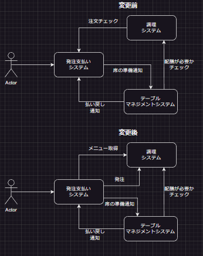
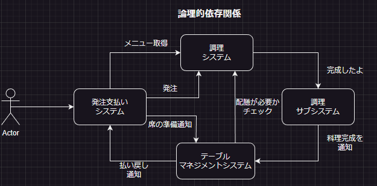
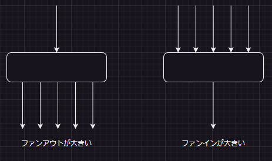
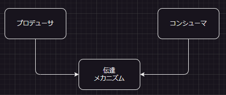
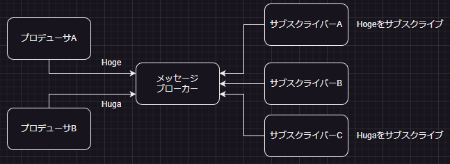
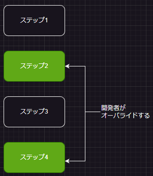
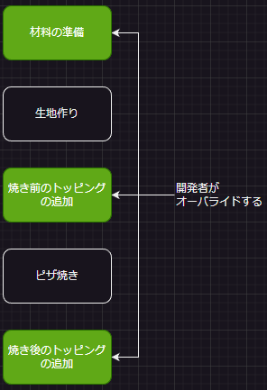
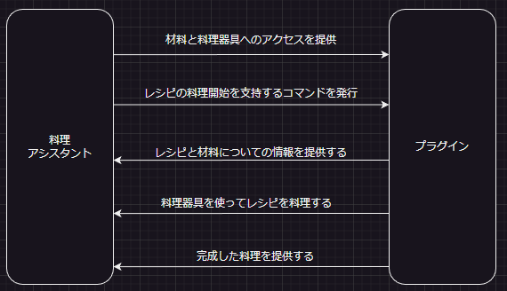

# RobustPython

Pythonクリーンで保守しやすいコードを書くために勉強する
[ロバストpython](https://www.oreilly.co.jp/books/9784814400171/)

# 1章 ロバストpython入門

コードの意図を未来に伝える

コレクション型でも様々な型がある

- リスト
- 文字列
- ジェネレーター
- タプル
- 集合

なぜ関数では**なぜリストが使用されているか**を使っているかを未来の開発者にコードを通して伝えていかなくてはいけない

# 3章 型アノテーション

## 型アノテーションとは何か

- 型アノテーションは型ヒントとして機能する
- コードの読み手にヒントを提供するが実行時にpythonが使用する情報ではない
- 型ヒントに逆らってもエラーは起きない

## 型アノテーションの利点

- 型アノテーションを入れればpython対応のエディタの多くは自動補完で、その変数が可能な操作を指し示す
- 静的解析ツールを使用することでアノテーションをチェックして、不適切な個所を指摘することができる
- テストやコードレビューの前に早い段階でバグを発見でき、時間とコストを削減できる
- Pythonの動的型付けを保ったまま、静的型付けのメリットを与える
- 型アノテーションは簡単に付け加えることができるが、つけすぎると逆にコストの方が大きくなる

### クラスの型チェッカはどのような場合に使うべきか

- 他のモジュールや利用者が呼び出すとき(公開API, ライブラリのエントリポイントなど)
- 型が複雑で、わかりにくい場合
- mypyがデータ型を指定すように指示する場所(一般に空のコレクションへの代入をするところ)

# 4章 制約型

高度なアノテーションを使用することでデータ型に制約を加えて、データ型が表現できるものをさらに制限できる

最初から間違ったコードが書かれないように、システム内で矛盾するデータ型や無効なデータ型を物理的に作りこめないようにする

型アノテーションを適切に使用出来れば時間とコストを削減できる

## Optional型

コードベース内のNone参照を置き換える

以下のようなメリットがある

- Noneが返却される可能性を開発者に伝えることができる
- Noneが返却された場合は処理しなければいけないエラーが発生したことを開発者に伝えることができる
- Optional型を使用していない場合は、Noneが返却されていはいけないことを開発者に伝えることができる

## Union型

複数の型が同じ変数で使用されていることを示すデータ型

以下のようなメリットがある

- 引数に基づいて異なるデータ型のオブジェクトを返却することを開発者に伝えることができる
- Optionalと同じようにエラーを表す型を開発者に伝えることができる

### データ型の積と和

4つのメンバ変数を持つクラスが存在する場合、そのメンバ変数の組み合わせは以下のように積になる

A x B x C x D

成功系と失敗系でプロパティを分けることで組み合わせの数を少なくすることができる

(A x B) + (C x D)

## Literal型

データ型の状態の数を強制的に制限できる

変数の状態を制限できる場合に使用できる

python3.8以上で導入されている

## Annotated型

Literal型の進化したやつ

一定サイズ以上の文字列や正規表現にマッチする文字列だけに有効な値を制限できる

python3.9以上で導入されている

## NewType型

よく理解できないので、後で学習する

## Final型

変数の値が変更できないようする

定数として使用するような感じ

グローバル変数などスコープが広い変数で利用すると効果が得られやすい

# 5章 コレクション型

4章では単一(int, float, str)のアノテーション方法を学んだ

今回は辞書、リストやセットなどの複数の型が集合するコレクション型のアノテーションを学ぶ

## 同種コレクションと異種コレクション

同種コレクション → 収められた型がすべて同じ Ex. [5,6,7,8,9]

異種コレクション → 収められた型が異なる Ex. [5,"hoge", 6.247]

- 何をもって同種とするのかを意識する 単純にintだけがコレクションに入っていれば同種というわけではない
- Union型にアノテーションしたい型を詰め込みすぎるとコードが複雑になる
- Any型はすべてのデータが型が入ることをできるが、型アノテーションの目的が失われる

## TypeDict

Python3.8で導入された辞書に異種データを格納しなければならない場合のために作られた

## ジェネリックス

よく分からないので飛ばす

## 既存のデータ型の変更

辞書を継承してメソッドをオーバライドしても、そのメソッドが辞書のその他のメソッドから呼び出されるという保証はない

collections.UserDict, UserString, UserListを使うとよい

## ABC

collections.absのABCは、すべてのカスタムコレクション型の作成を目的とする

よく分からないので飛ばす

## まとめ

- 組み込みメソッドをオーバーライドしようとするとPythonが予期しない振る舞いをするので注意が必要
- リスト、辞書、文字列の一部を変更したい場合はcollections.UsrList, collections.UsrDict, collections.Stringを使用する
- 他のコレクション型と同じインターフェースでより複雑な振る舞いをするクラスを書く必要があるなら、collections.abcを使用する

# 6章 型チェッカのカスタマイズ

型チェッカ(mypyやPyreなど)は適切な使い方ができれば強固なツールとしてしようできるが

**厳密度**を調整しないとアノテーションの量が増えすぎたり逆にアノテーションの意味を成さなくなることもある

型チェッカには厳密度を調整できるオプションが存在するため、そこで厳密度の調整をする必要がある

型チェッカには以下のようなライブラリが存在する

- mypy
- Pyre
- Pysa
- Pyright

# 7章 実践的な型チェッカ導入

型アノテーションにはコストがかかる。コストがかかった分メリットもあるが、コストがメリットより大きくなっては意味がない

どれだけ早くコストとメリットと損益分岐点に到達できるかが重要である

コードのどの部分に対してアノテーションを実行するかの戦略は以下の例があげられる

- 新規コード
- 共通部分のコード
- ビジネスロジックのコード
- 書き換え頻度が高いコード
- 複雑なコード


[MonkeyType](https://yiskw713.hatenablog.com/entry/2022/05/21/170000)を使用すればある程度自動でアノテーションを追加できる

MonkeyTypeは実行時に観測できたコードにしかアノテーションができないため、デットコードにはアノテーションができない問題点がある

[Google](https://zenn.dev/seratch/articles/21d80ab3bf8c07c39c52)が開発したPytypeは静的解析によって型アノテーションを追加できる

また、Pytypeは本格的なリンターとしても使用できる

型チェックツールを導入してアノテーションのコストを削減することも重要である

# 8章 列挙型
### ユーザー定義型
開発者が独自で作るデータ型  
独自のデータ型にはドメインの知識が格納されており、非常に重要な役割を果たす  

### 列挙型
python3.4から導入されたEunm型 → 複数の選択肢から1つを選択して欲しい場合に使用する  
アノテーションとしてEnum型とすることによって、開発者はEnum型のどれかかの値が必要であることが分かる  
選択肢が静的である場合はEnum型は強力なツールとなるが、選択肢が動的である場合は**辞書型**がよい  

#### 列挙型の高度な使い方 auto()
メンバの値について特別な指定が必要ない時に使用する
python3.8からLiteralが導入されたため、単純な制限だけであるならLiteralを試した方が良さそう

#### 列挙型の高度な使い方 Flag()
複数の状態を持たせたい場合に使用する

#### 列挙型の高度な使い方 unique()
キーの重複を許したくない時に使用する

# 9章 データクラス
ここまでは同種コレクションのアノテーション方法であったが、実際の開発では  
単一のデータ型に複数のデータフィールドを埋め込みたい場合がある  
辞書やタプルでも可能ではあるが、実行時に何が格納されているか分からないという問題点がありロバストネスを大きく損ねる  
データクラス型を用いることによって、構成要素が明らかになるだけでなく、コードの利用者は必要なフィールドを必ず埋める必要がある    
また、メソッドを埋め込むことができる  
使用例↓↓  
```
@dataclass
class Human:
    weight: int
    height: int
    walk()
    run()

# インスタンス化
human = Human(weight=56, height=168)
```
データクラス型でできること  
- 文字列への変換
- 等価比較
- 比較
- イミュータブル
  
異種データを扱う際は辞書型より、型チェッカで確認ができるデータクラス型を検討した方がよい  
異種データのコレクションとしてTypedDictも存在するが以下の理由からdataclassの検討をした方がよい  
- メソッド定義可能
- イミュータブル性
- 等価比較
- 大小比較
  
# 10章 クラス
いつクラスを使うべきなのかを考えてロバストネスを向上させるためのクラスについて学ぶ  
## dataclassではなくクラスを使用する理由
### 不変式
エンティティが生涯に渡って変化しないエンティティの性質 -> 数学的な性質、ビジネスルールなど  
不変式の例  
- すべての従業員は一意なIDを持ち重複しない
- 円は正の半径しかもたない
- 映画館にはポップコーンを持っていく
  
クラスで不変式を定義する際の基準点(以下の質問にすべてYesであればクラスで実装する)  
- 型システムでは検知できないようなデータの制限を加えるべきか
- フィールド感の相互依存関係はあるか
- データに関して提供したい保証はあるか？
  
不変性を定義するということはDRY原則やSOLID原則の一部を守ることにも関係してくる  
#### DRY原則
Don't Repeat Yourselfの略称  
ロジックの重複などを極力避けようねというプログラムをする際の原則
#### SOLID原則
ソフトウェア構築時に従うべき原則  
- Single Responsibility -> 単一責任の原則: クラスは、単一の責任を持つべき(1クラスに複数の役割を持たせない)
- Open-Closed -> オープン・クローズドの原則: クラスは、拡張にはオープンで、変更にはクローズドであるべき
- Liskov Substitution -> リスコフの置換原則: 子クラスは親クラスと同じリクエストを処理し、同じ結果か同様の結果を提供できなくてはいけない
- Interface Segregation -> インターフェイス分離の原則: クライアントが使用しないメソッドへの依存を、強制すべきではない
- Dependency Inversion -> 依存性逆転の原則: インターフェイスを導入することにより、上位レベルのクラスが下位レベルのクラスに依存するのを減らす  
  
### 不変式の伝え方
新しくプロジェクトに入った人は、そのプロジェクト特有の決まり事を知らないので  
不変式を通して伝える必要がある  
伝え方は大きく二種類ある  
#### クラスの利用者への伝え方
最良の場所はdocstring
```
このクラスは、コーヒーメーカーが受け取るコーヒーの注文内容を表現する
トッピングの順番は必ずクリームが一番最初であり、残りのトッピング順は自由である
コーヒー豆に関する表現内容
- コーヒー豆の大きさは5mm以上10mm未満であり条件を満たせていないとアサーションエラーが起きる
- コーヒー豆の種類は1種類だけであり条件を満たせていないとアサーションエラーが起きる
- コーヒー豆の重量は整数である
```
#### メンテナへの伝え方
Pythonのコンテキストマネージャを使用する  
コンテキストマネージャについては後述する  

### 不変式のカプセル化
インスタンス化の後に不変式が破られるのを防ぐ  
クラスの利用者が不変式を破るのを防止するには、そのデータが**プライベート**であることを示す  
プログラム言語の多くは3種類のアクセス制御を提供している  
- パブリック -> コードのどこからでもアクセス可能
- プロテクト -> そのクラスと派生クラスのオブジェクトだけがアクセス可能
- プライベート -> そのクラスのオブジェクトだけがアクセス可能
  
pythonの場合アンダースコアで表現する    
- _hoge -> プロテクト
- __hoge -> プライベート
  
## 型選びについて
以下の内容を考えて列挙型、辞書型、データクラス型、クラスを選択する  
- 同種か異種か
- スカラーかコレクションか
- 不変式があるかないか

# 11章 インターフェースの定義
自分が作成したデータ型のAPIは開発者/メンテナが使うことになる  
その際に使用者が自然に使えるインターフェースを目指すべきである  
インターフェース(コードと言い換えることもできる)が使いずらいと以下のような問題が起きる
- 機能の重複 -> 別の使用者が独自のデータ型を作成して機能が重複する
- メンタルモデルの破壊 -> 推論できないデータ型にぶつかると間違った順序でメソッドを呼び出したり、誤解して情報を渡してしまう
- テストの不徹底 -> 使いづらいコードはテストもしずらい  
  
## 利用者のように考える
開発している時はそのインターフェースが自然かどうかは判断がしずらいので利用者視点で考えることが重要である  
利用者のように考えることができる戦略
- テスト駆動開発
- README駆動開発
- ユーザビリティテスト
  
ちょっとよく分からないことが多いので再度学習する

# 12章 部分型
他のデータ型を基底として新しいデータ型を作る部分型について学ぶ  
部分型を適切に扱うことでコードベースの拡張が簡単になる。  
しかし、使い方を誤ると思わぬところでコードベースのロバストネスを損なうことになる  
## 継承
元のデータ型のあらゆる振る舞いをコピーして新しいデータがを作ること  
継承元のデータ型を親クラス、基底クラス、スーパークラスと呼ぶ  
継承したデータ型を子クラス、派生クラス、サブクラスと呼ぶ  

親クラスと子クラスはis aの関係であり  
Aクラスを継承したBクラスとCクラスは  
Bクラス is Aクラス  
Cクラス is Aクラス  
という関係となる  

また、親クラスの動作を変更せずに子クラスだけ別の動作をしたいときはメソッドをオーバーライドすることができる  

### 置換可能性
継承はis-aの関係で簡単そうであるが実は間違いが起きやすい  
is-a関係をモデリングするときは置換可能性を理解する必要がある  
「正方形は長方形である」を例に考える  
Squareクラスのset_widthをオーバーライドせずにRectangleのset_widthを呼び出すようにすればエラーは発生しないが正方形を維持出来れおらずクラスの不変式を破壊していることになる  
派生クラスに変更を加えた場合は基底クラスを呼び出したり使ったりした全ての個所を確認して、変更によるコードの破壊が起きていないかを確認する必要がある  
**継承を設計するうえで守る必要がある内容**
- 不変式
- 事前条件 -> データ型の性質を操作する前に真でなければいけいない条件
- 事後条件 -> データ型の性質を操作した後に真でなければいけいない条件
  
## コンポジション
コードの再利用のためだけに継承を使用するのは良くない  
上位型が使用されることがないことを前提としたコードで部分型が使われることがないなら、is-a関係をモデリングする必要がない  
has-aの関数と言われるコンポジションを使用するべきである  

# 13章 プロトコル
型チェッカは静的解析の時点で分かっているデータ型なら処理できるが、実行時に行われるダックタイピングには手が出ない  
この問題を解決するためにpython3.8移行では**プロトコル**が導入された  

## 部分型の種類
部分型には大きく2種類存在する  
- 構造的部分型 -> データ構造自体が異なる
- 名目的部分型 -> 名前が異なるのでデータ型として区別される  

## 構造的部分型と名目的部分型を調和させる解決策
- Any -> ロバストネスが損なわれる
- Unison -> クラスを追加するごとに関数に追加する必要がある
- 継承 -> クラス分割が増えすぎてメンテナが大変になる
- ミックスイン -> 継承する内容が増えすぎる

## プロトコルとは?
型ヒントと実行時型システムの隙間を埋める方法を提供する  
また、型チェッカ内の構造的部分型を提供する  
複数のプロトコルを集めた複合プロトコルを作成することもできる  
@runtime_checkableのデコレーターをつけることで実行時型チェックも可能  
プロトコルはPythonの日常的な書き方ではないが、契約に従うことが求められる設定ファイルやプラグインアーキテクチャを使う場合には目にすることがあるかもしれない  
プロトコルを使用することでコードの物理的な依存関係が削除され、それが保守性の向上につながる上に早期にエラーを検知できる  

# 14章 pydanticによる実行時型チェック
可能な限りテストや本番稼働前にコードエラーを発見しておきたいが、全てのエラーを静的解析だけで発見できるわけではない  
例えば以下のような例は実行時しか発見できないエラーである  
- DB接続などの設定ファイル
- ネットワークリクエスト
  
プログラムの外から受けるデータには不正なデータを受け取る危険性があり、どれだけロバストなコードを書いたとしても、ユーザーが不正なデータを渡すこと自体は防ぐことができない  
バリデーションロジックを大量に書くことによって渡されたデータが全て正しいかを確認することはできるが、コードが多くなり複雑になってしまう  
そこでpydanticライブラリを使用することでバリデーションロジックのコードを削減し、可毒性を犠牲にしない方法を学ぶ  

## TypeDicts
欠損フィールドやデータ型が間違っていないかをチェックできる  
しかし、このアプローチには以下のような問題点がある  
- TypeDictの構築を制御できないので、オブジェクトの構築作業の一部としてフィールドチェックができない  
- メソッドを追加できない
- 暗黙のバリデーションがないため、YAMLから誤った辞書を作成しても型チェッカはそのことを教えてくれない  
  
## pydantic
TypeDictsのように継承が必要なくpydantic.dataclasses.dataclassでクラスをデコレートする  
pydanticがオブジェクト構築時にバリデーションを行ってくれる  

### バリデータ
pydanticにはバリデータという機能があり、以下のようなことが実行できる
- 文字列の長さを指定
- 正の数だけOKとする
- 正規表現にマッチする文字列だけとする
- リストの要素はXXX型の値に限られ少なくとも2以上の値が必要になる
- 検知できないエラーはバリデーションロジックを末尾に組み込める
  
pydanticはバリエーションライブラリではなく**パースライブラリ**であるためデータモデルから出るものが正しいことを保証する  
そのため、pydanticは定義されたデータ型に合致するデータを出力するためにできる限りのことをする  

# 15章 拡張性
システムの拡張性が上がれば開発者は自信をもってコードベースを拡張でき、エラーの可能性が下がる  
コードベースの寿命が尽きるまで開発者はソフトウェアを修正する  
修正のレベルによってはアーキテクチャの重要な部分を入れ替えたりする必要があり、影響範囲も広くなる  
単純な型チェックだけでは影響範囲全てのエラーを検知することが難しい  
よって、頻繁に変更される部分で簡単に拡張できるポイントを用意しながら設計することが重要である  
## 解放閉鎖の原則(OCP)
Open-Closed Principle(OCP)はコードの拡張に対しては解放的、変更に対して閉鎖的であれという考え方である  
重複しているコードを削除して変更すべき点が容易に発見できるというのが大切なポイントである  
### OCP違反の見つけ方
- 簡単なことが難しくなっていないか
- 類似の機能の実装が遅れていないか
- 見積りがいつもより大規模になっていないか
- コミットに大規模な差分が含まれているか

## 拡張性の欠点
柔軟になり過ぎるとコードベースは劣化する  
コードベースは過度に抽象化されて依存関係が複雑になり、新規参入者がキャッチアップする速度を下げる  
過度に使用しない点も重要である  

# 16章 依存関係
関数レベル、モジュールレベル、プログラムレベルでの依存関係があり適切に管理しないと各関係図が複雑になってくる  
アーキテクチャを本当に単純化する方法を学び、複雑さを管理し、コードベースのロバストネスを向上させる  
## 関係
あるコードが特定の形での動作するために別のコードを必要とするなら、それを**依存関係**と呼ぶ  
既存のものを再利用すれば得られる利益は大きくなる  
利用するコードが読みやすいようになっていればなお良く、他の開発者がエラーを見つけて修正しやすくなりコードのロバストネスが向上する  
しかし、依存関係が多くなるほど依存先が変更した際の修正内容も多くなる(ライブラリがバージョンアップしたら既存の利用部分が使えなくなる)  
セキュリティの観点からは依存関係を増やすと攻撃対象を増やすことになる(使用しているライブラリに脆弱性があると、こちらも攻撃対象に入る)  
[脆弱性に特化したWebサイト](https://cve.mitre.org/cgi-bin/cvekey.cgi?keyword=python)  
## 依存関係のタイプ
大きく以下3つに大別できる
- 物理的
- 論理的
- 時間的
### 物理的依存関係
コードで直接観察できる依存関係のこと  
関数が他の関数を呼び出したり、モジュールが他のモジュールをインポートする場合  
実行時に変化しない静的である  
例えばレストランシステムに新たなメニューを追加した場合を考える  
  
何かしらの不具合があった場合に、変更前のアーキテクチャでは「料理システム」と「発注支払システム」2つの関係するコードを修正する必要がある  
しかし、変更後のアーキテクチャでは「料理システム」の新たなメニューようで作成した部分のコードだけの修正でよい(調理システムのメニューから新規メニューを消せばよいだけ)  
これによって緊急事態が発生した場合でも自分の立場を守れるだけでなく、将来のビジネスの柔軟性も高められる  

### 論理的依存関係
レストランシステムにおいて各システムの関数を間接的に呼び出すサブシステムが存在すると考える  
料理システムで料理が完成したら、サブシステムを通してテーブルマネジメントシステムにリクエストを投げる  
サブシステムをはさむことにより、直接的な関係(物理的依存関係)がなくなり論理的な関係となる  
  
#### メリット
論理的依存関係によるメリットは交換可能性である。直接的な依存がなくなるため、料理システムはテーブルマネジメントシステムが別のものに変化しても影響を受けることはない  
交換可能性が上がれば保守性が上がり、機能を丸ごと交換することができる  
#### デメリット
直接的な関係が分かりづらくなるため、コードが読みづらくなり、理解の難易度も上がる -> 可読性が下がる  
各システムをつなぐ抽象化レイヤが多くなるとスパゲッティのようになってしまう  

### 時間的依存関係
論点的依存関係の一種であり、時間的な前後関係で繋がった依存関係である  
(例) 注文の前に支払いを求めなければならない  
*対策が理解できなかったので飛ばす

## 依存関係の可視化
以下のライブラリを使用すれば各レベルでの依存関係を可視化することができる  
- パッケージの可視化 -> pipdetree, graphviz
- インポートの可視化 -> pydeps
- 関数呼び出しの可視化 -> pyan3

### 依存関係の捉えかた
変更するものとそれに依存するものとの関係を考える必要がある  
ファンインとファンアウトを区別して、それぞれに必要な対策をとる必要がある
  
#### ファンインが大きい
依存元が多くあり依存先が少ない  
このようなエンティティは底の方に集めて、頻繁に書き換えられないように済むようにしたい  
依存先が多い分、コードベースの広範囲に影響を及ぼす可能性がある  
#### ファンアウトが大きい
依存元が少なく依存先が多い  
このようなエンティティは上の方に集める  
ビジネスロジックが多く含まれる場所であり、ビジネスの変化と共に振る舞いが変化する  

# 17章 コンポーザビリティ
ソースコードはビジネスの進化と共に変化する  
将来に変更しやすく摩擦の少ない、どんな状況にも対応できるコードが必要である  
コンポーザビリティを意識して書いたコードは小さくて独立性が高く再利用できるようになる  
## コンポーザビリティとは何か?
相互作用を抑えて内部にビジネスロジックをほどんど含まない小さなコンポーネントの構成に重点を置く  
将来の開発者がそれらのコンポーネントを使って自分のソリューションを構築できるようにするのが目標である  
例えばchapter9では数個のデータクラスからRecipeを構成したが、別にデータクラスに分けずに全てをRecipeクラスに入れてもよい  
しかし、それでは異なるデータ型を作るときに1から作り直す必要がある  
これは独立の高いデータ型を組み合わせて新しいデータ型を作る**データ型のコンポジション**の例である  
## ポリシーとメカニズム
ポリシー: ビジネスロジック。ビジネスニーズを解決するための直接的な責任を負うコード  
メニュー本でいうとメニューが該当する  
メカニズム: ポリシーを実現するためのコード　　
メニューを作るための仕組み  
メカニズムとポリシーを分けることでコードをコンポーザブルにする  
メカニズムは再利用することが多いので、メカニズムとポリシーが一緒になっていると再利用しずらいコードになる  
ポリシーとメカニズムの分離の優れた実例はPythonのloggingモジュールである  
ポリシー: 何をどこに記録するかのアウトラインを示す  
メカニズム: ログレベルの設定、ログのメッセージのフィルタリング、ログメッセージの書式設定などの仕組みを担う  
### デコレータ
デコレータを使用することで、関数本体に手を付けずに振る舞いを変更することができる  
外部から振る舞いを変更することで関数自体のネスト深くなり過ぎることを防止できる  
[単純なデコレータ](https://zenn.dev/ryo_kawamata/articles/learn_decorator_in_python)  
[backoff](https://qiita.com/cheuora/items/7e0355b74b7a30bcaca9)  
### コンポーザブルなアルゴリズム
ポリシーとメカニズムの分離が必要になってくる  
たとえば、レストランシステムにメニューの推薦機能を導入したいとする  
複数の推薦アルゴリズムを使いたい場合や将来にアルゴリズムが追加されることを考えると柔軟性が求められる  
たとえば、以下2つのアルゴリズムを使いたいとする  
```
アルゴリズム1
1. 全ての日替わりメニューをイテレートする
2. 余剰材料リストと類似性に基づいてソートする
3. 余剰材料リストが上位になっている料理だけを残す
4. 最後に注文した料理と類似性に基づいて料理をソートする
5. 類似度が75%以上の料理だけを残す
6. 上位3料理を残す
```
```
アルゴリズム2
1. メニュー全てをイテレートする
2. 最後に注文した料理と類似性に基づいて料理をソートする
3. 類似度が最も高い料理だけを残す
4. 日替わりメニューか余剰材料が3種類以上の料理だけを残す
5. 5位までの料理を残す
```
2つのアルゴリズムを抽象化すると以下のようなメカニズムに分割できる(ポリシーは<>で囲む)  
```
1. <料理リスト>をイテレートする
2. <第1ソート基準>に基づいて料理をソートする
3. <フィルタリング基準>で上位になっている料理だけを残す
4. <第2ソート基準>に基づいて料理をソートする
5. <フィルタリング基準>で上位になっている料理だけを残す
6. 上位<x個>の結果を返す
```
具体的なアルゴリズムのコードはjupyterファイルに記載  

# 18章 イベント駆動アーキテクチャ
システム内の通知を中心に捉える  
既存システムの影響を最小限に抑えながら新機能を導入することが可能である  
## 仕組み
刺激を送る**イベントプロデューサ**と刺激を受ける**イベントコンシューマ**から成る  
| プロデューサ | コンシューマ |
| :---: | :---: |
| キッチンタイマーが動作する | オーブンから鍋を外す |
| 目覚まし時計がなる | 起きる |
イベントアーキテクチャではプロデューサとコンシューマの物理的依存関係を断ち切ることで柔軟なアーキテクチャにすることが目的である  
プロデューサとコンシューマの間には**伝達メカニズム**が存在し、それがデータをやり取りする通路になっている  
  
### 欠点
#### 論理的依存関係の問題
プロデューサとコンシューマは共通の識別子とメッセージ形式を受け入れているため片方が勝手に形式を変更すると関係が崩壊する  
この問題の緩和は16章を確認すること  
#### 型チェッカがあまり役に立たない
コンシューマが間違ったイベントタイプに依存するようになっても、型チェッカではそれを検出できない  
プロデューサやコンシューマのデータ型を変更しようとすると、他のプロデューサやコンシューマもそれに合わせて更新する必要がある  
#### デバックが困難
プロデューサやコンシューマにはデバックでステップインできるが、伝達メカニズムにステップインするとサードパーティー製のコードであったり、最悪の場合、別プロセスや別マシンで実行されている場合もある  
複数のデバッガを起動させる必要がある  
#### イベント処理が難しくなる
プロデューサとコンシューマが切り離されているため、例外がエラーをプロデューサが簡単に処理できるとは限らない  
コンシューマAの例外をコンシューマBはその例外をキャッチすればいいのか?  
プロデューサはエラーについて知るべきなのか  
様々な問いに答えを1つに絞るのは難しい  
## 単純イベント
イベント駆動アーキテクチャの最も簡単な形は、何かしらの条件が変わった場合に発生する**単純イベント**の処理である  
情報のプロデューサはイベントを送り、コンシューマはイベントを受け取って反応する  
実装方法にはメッセージブローカーありとなしの2種類がある  
### メッセージブローカーあり
プロデューサは特定のトピックに対してメッセージと呼ばれるデータをパブリッシュする  
コンシューマは同じ識別子を使ってトピックをサブスクライブする  
メッセージブローカーはトピックをサブスクライブしているサブスクライブしたコンシューマにメッセージを送る  
サブスクライバーAはHogeトピックをサブスクライブしているため、プロデューサAからHogeトピックのメッセージが発行されたらメッセージブローカーがサブスクライバーAにそのメッセージを送る  
  
PythonではPyPySubライブラリを使用する  
サブスクライバーとパブリッシャーはお互いに依存がなく、両者が依存しているのはPyPubSubライブラリとトピック/メッセージデータについての認識の一致だけである  
そのため、通知を追加する際には新たなトピック/メッセージデータとパブリッシャー、サブスクライバーを追加するだけで拡張が可能である  
### Observerパターン
メッセージブローカーを使用したくない場合に対応できる  
プロデューサはオブザーバー(コンシューマのリスト)を持っており、メッセージブローカーとしての別のライブラリは不要  
**Observerの欠点**  
- オブザーバーが例外を出したときは、プロデューサはそれを直接処理できる必要がある
- プロヂューサがオブザーバーの知識が必要となり、オブザーバーの知識を持つコードに到達するまでのコールスタックが積みあがることがある
  
### ストリーミングイベント
イベントがストリームと呼ばれる連続的なデータとして流れ込む場合に対応できる必要もある  
イベントストリームを中心におく場合は**リアクティブプログラミング**というアーキテクチャを採用する  
ストリームを生成するデータソースを定義し、複数のオブザーバーを連携させる  
各オブザーバーはデータに変化があると通知を受け、データストリームを処理する一連の操作をする  
pythonではRxPYライブラリが使用できる  

# 19章 プラガブルPython
他の開発者が機能を拡張するために使える部分を含むフレームワークを定義する  
掃除機に様々なアタッチメントがあるように用途に合わせてアタッチメントを変更して機能を拡張できることをコードベースでも実施する  
基礎の部分を作り込むことが出来れば、他の開発者はアタッチメントの部分(プラグイン)だけを作ることでアプリケーションを拡張できる  
## Temlate Methoedパターン
アルゴリズムの空白部分を埋めるためのパターン  
アルゴリズムは一連のステップとして定義されるが、呼び出して元にそれらのステップの一部を強制的にオーバライドさせる考え型  
  
ピザを作る一連のアルゴリズムで考えると以下のようになる  
  
テンプレートメソッドに新しい関数を渡すだけで、新しいピザ風料理調理機能をオンラインに流すことができる  
## Strategyパターン
Temlate Methoedパターンではアルゴリズムの一部を入れ替えることには役立つがアルゴリズム全体を入れ替えたい場合はどうするのか  
同じインターフェースを実装する**交換可能**な「アルゴリズム」をいくつか定義して、プログラム実行時に適切なアルゴリズムを選択する  
アルゴリズム == 複数あるやり方の1つのやり方  
## プラグインアーキテクチャ
Temlate Methoed, Strategyはクラスや関数といった小さな機能をプラグインする場合は効果的である  
アーキテクチャでも同じようなパターンが使える  
  
pythonでのプラグイン管理には[stevedore](https://docs.openstack.org/stevedore/latest/install/index.html)が使用できる  
プラグインとは実行時に動的に読み込まれるコード  
**プラグインの拡張性以外のメリット**
- コアのコードベースとは別にデプロイできるためアップロードの粒度を細かくできる
- サードパーティーがコアのコードベースを書き換えずにプラグインを書ける
- プラグインはコアのコードベースとは別に開発できるため通常より密結合なコードが生じずらい
  
